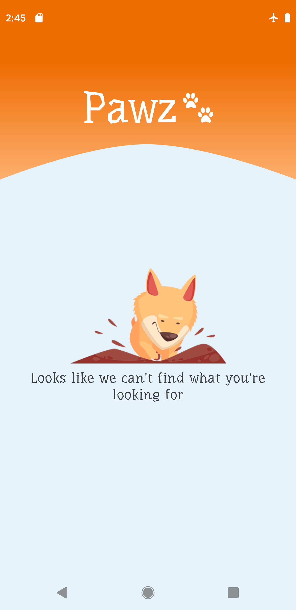
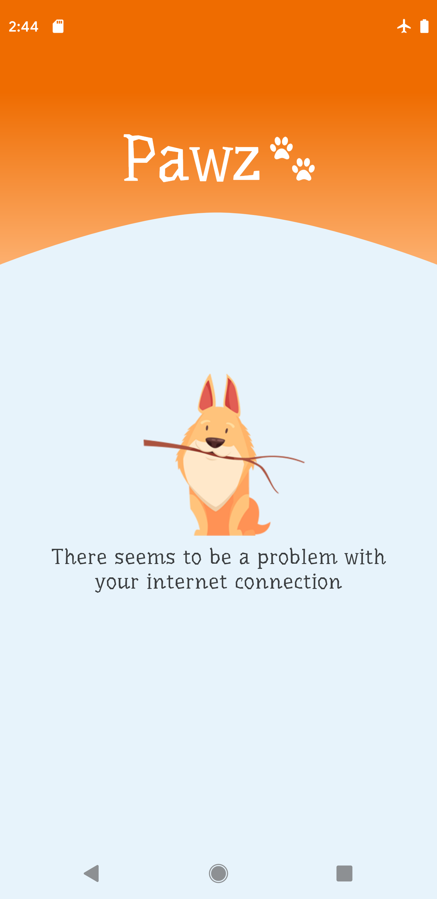
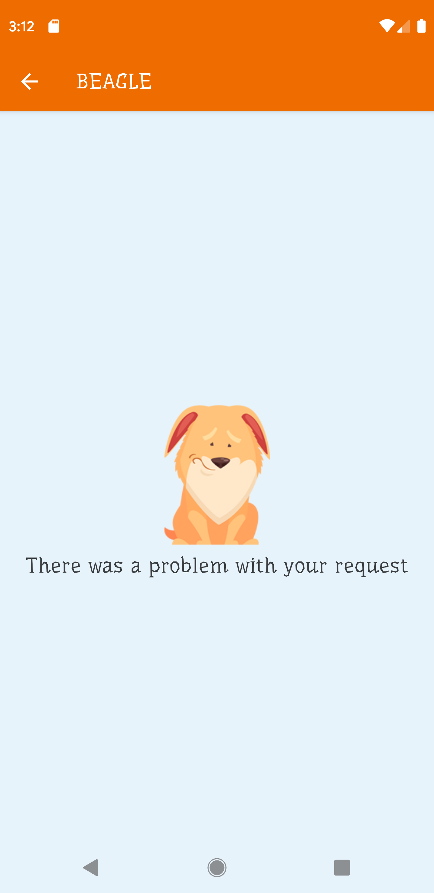
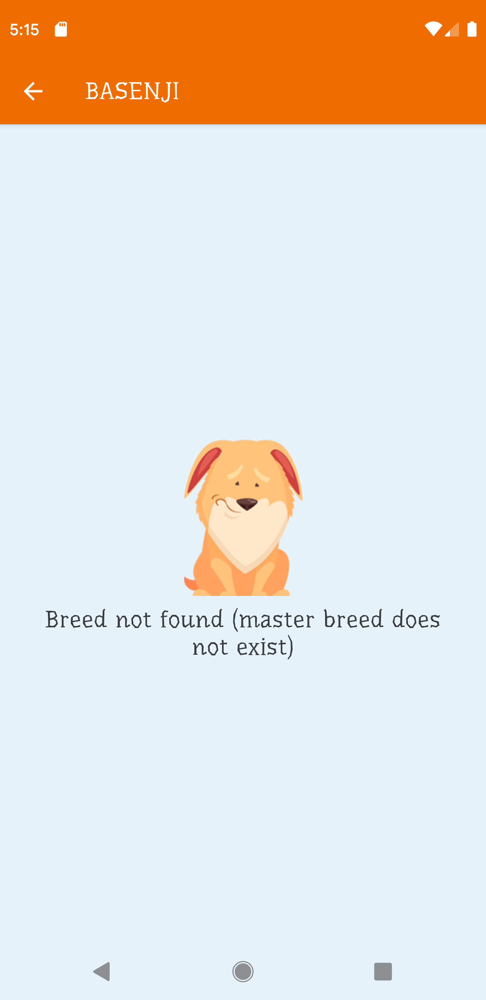

#  Pawz 


This is a simple app that reads and displays data from [https://dog.ceo/dog-api/documentation/](https://dog.ceo/dog-api/documentation/)

## Code organization

The majority of the projects I worked on included an SDK component, so the code was obviously modularized but in this instance I saw no need to add different modules. As such, the gradle dependencies are added directly in the app module instead of my usual practice of using **buildSrc** to define them.

## CI compatibility

I use *gradle.properties* to define custom properties for variables that can change based on the environment the app runs in. For this project only the API URL and a simple flag for allowing logs are defined as custom properties.

These properties are wrapped inside a configuration object that can be injected where it's necessary.

This app is using Bitrise.

## Architecture

I chose a simple MVVM architecture with deterministic UI states represented by a specific [ViewState]().

For this app it makes it really easy to render the UI and keep track of the current states(empty,error, data).


## Dependency Injection

I use DaggerAndroid for dependency injection. I found that libraries that use the service locator pattern tend to get messy really quick.

To solve the problem of injecting ViewModels I have defined a custom factory(**PawzViewModelFactory**) and a custom key that effectively creates a map for every ViewModel. For this app I don't use SavedState and I think the approach would probably need some tinkering to make it work. 

To reduce Dagger boilerplate from Activities I created an Object called *AppInjector* that is bound to the lifecycle of the app.

This object will automatically inject any activity/fragment that implements the *Injectable* interface(this is an empty interface). 

## Network

For networking I use Retrofit + RxJava. 

The API seems to be very deterministic in the sense that it will send a message of type:

``` 
	message: T,
	status: String,
	code: Int?
``` 

To handle the different response types I created a generic wrapper class **DogApiResponseDto**.

This wrapper is used in the data layer and the repository will convert this to a domain model.

## Error handling

I created a simple set of errors specific to the app, I call these domain-level errors because they are not bound to the origin of the  error and the UI knows how to represent them.

For handling network errors I created a custom CallAdapterFactory for Retrofit.

This factory will essentially intercept every error thrown at the network layer, convert it to a domain error and propagate it upstream.

You could say that this factory is crossing the data-domain layers, and generally you would want to define separate error types for the data layer and let the repository map to the domain error. 
I chose to map the errors directly in the call adapter factory to save some time.


## Testing

### Unit tests

Test components in isolation to make sure they have the intended behaviour

- **PawzCallAdapterFactoryTest** -> creates a mock server and tests that the custom call adapter factory correctly returns data or a PawzError
- **DogBreedRepositoryTest** -> checks that the repository correctly transforms data from retrofit or throws a PawzError
- **BreedGalleryViewModelTest** -> checks that BreedGalleryViewModel sends correct states to the UI
- **BreedListViewModelTest** -> checks that BreedListViewModelTest sends corerct states to the UI


### Integration tests

Check that the repository, use cases and view models interact correctly and output the expected UI states.

- **BreedsListActivityTest** -> use fake API and check that the activity renders the correct UI states
- **BreedGalleryActivityTest** -> use fake API and check that the activity renders the correct UI states

## Improvements

- <s>create a custom view for the loading state so we can encapsulate animation related code</s>
- ViewStates for the screens are similar and have duplicate states(loading,error), look into extracting some base state class
- take advantage of the splashscreen to pre-fetch the list of breeds and download a random image for every breed to use as a cover image


## Images 

The images used in the empty/error states where obtained from
 <a href="http://www.freepik.com">Designed by macrovector / Freepik</a>.
 
 The other icons used in the app where obtained from free vector sites and modified in Figma & Shapeshifter
 
## Screenshots
 
 
 
 
 
